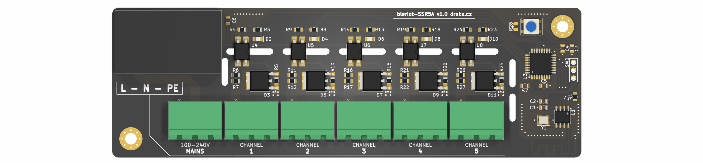

# BleRiot SSR5A

SSR5A is a mains-powered five-channel BleRiot switch intended primarily for
zone thermo-electric actuators in hydronic heating systems. Each independently
controlled output switches mains line through a zero-cross optotriac and triac.



The board combines a PY32F030 microcontroller, PAN2110 radio, five output
channels, a WS2812B status LED, and an isolated 3.3 V mains power supply. The
outputs are on/off switches; they are not phase-angle dimmers.

## Connections

Connector numbering follows the KiCad schematic.

| Connector | Pin 1 | Pin 2 | Pin 3 |
| --- | --- | --- | --- |
| `IN1` | Line (L) | Neutral (N) | Protective earth (PE) |
| `J1` | Channel 1 switched line | Neutral | Protective earth |
| `J2` | Channel 2 switched line | Neutral | Protective earth |
| `J3` | Channel 3 switched line | Neutral | Protective earth |
| `J4` | Channel 4 switched line | Neutral | Protective earth |
| `J5` | Channel 5 switched line | Neutral | Protective earth |

Each channel uses a MOC306x zero-cross optotriac and BTA08S-600CW triac. Its
on-board indicator LED follows the output directly.

## BleRiot Registers

An enabled channel is exposed as a writable boolean register:

| Tag | Register |
| ---: | --- |
| 1 | `ssr.channel.1` |
| 2 | `ssr.channel.2` |
| 3 | `ssr.channel.3` |
| 4 | `ssr.channel.4` |
| 5 | `ssr.channel.5` |

Each channel has inventory-as-code configuration in
[`fw/test-hub.go`](fw/test-hub.go):

- `Disabled` omits the register and holds the physical output off.
- `Inverted` reverses the logical-to-physical output mapping.
- `Default` selects the logical value applied after power-on and RF link loss.

Disabled takes precedence over inversion and the default. At startup, firmware
first biases every active-low triac control inactive, then applies the configured
defaults.

The node considers the BleRiot link offline after five seconds without a valid
packet. On the online-to-offline transition, it immediately restores every
channel to its configured logical `Default` and reapplies the corresponding
physical output level. This fail-safe also honors `Inverted`; for example, an
inverted channel with `Default: false` is physically energized while offline.
Choose defaults for the required safe state of the installation.

The smart LED on `PA6` is steady green-blue while the link is online and blinks
red while it is offline.

The RF-loss behavior has been verified on hardware: channel 1 was commanded on,
the hub was stopped, and its active-low MCU output returned inactive after the
five-second link timeout. After reconnecting, all five registers reported their
configured false defaults.

## Hardware And Firmware

| Function | MCU pin |
| --- | --- |
| Channel 1 | `PA11` |
| Channel 2 | `PA12` |
| Channel 3 | `PA15` |
| Channel 4 | `PB3` |
| Channel 5 | `PB4` |
| WS2812B data | `PA6` |
| PAN2110 CSN | `PA4` |
| PAN2110 SCK | `PA5` |
| PAN2110 data | `PA7` |

The firmware uses TinyGo and targets the `py32f030x8` profile. Its local hub
inventory bridges the radio node to a Registry server. The SWD connector carries
SWDIO, ground, and SWCLK but no reset or target-voltage connection, so the
project's pyOCD commands use attach mode.

## Repository Layout

- [`board/`](board/) contains the KiCad schematic, PCB, BOM, and fabrication
  outputs.
- [`fw/`](fw/) contains the TinyGo node firmware, tests, and local hub inventory.
- [`fw-orig/`](fw-orig/) contains the original MicroPython firmware for reference.
- [`sub/hw-kicad/`](sub/hw-kicad/) is the shared KiCad library submodule.

Initialize the shared hardware library after cloning:

```sh
git submodule update --init --recursive
```

## Build And Test

The firmware requires Go, TinyGo with Puya target support, GNU Arm Embedded
binutils, and pyOCD with the Puya CMSIS pack.

```sh
go -C fw test ./...
go -C fw run . make ssr build
go -C fw run . make ssr flash
```

With a Registry server running, start the local hub:

```sh
go -C fw run . hub --registry http://localhost:8080 --diagnostics rf
```

## Safety

This design connects directly to hazardous mains voltage. Assembly,
installation, testing, and enclosure work must be performed by suitably
qualified people using applicable electrical codes and safe isolation
practices. Independently verify protection, creepage and clearance, protective
earth continuity, enclosure construction, triac thermal limits, and actuator
ratings before deployment.

Do not wire mains or an actuator from this README alone. Verify the assembled
board against the schematic, PCB, and actuator manufacturer's documentation.